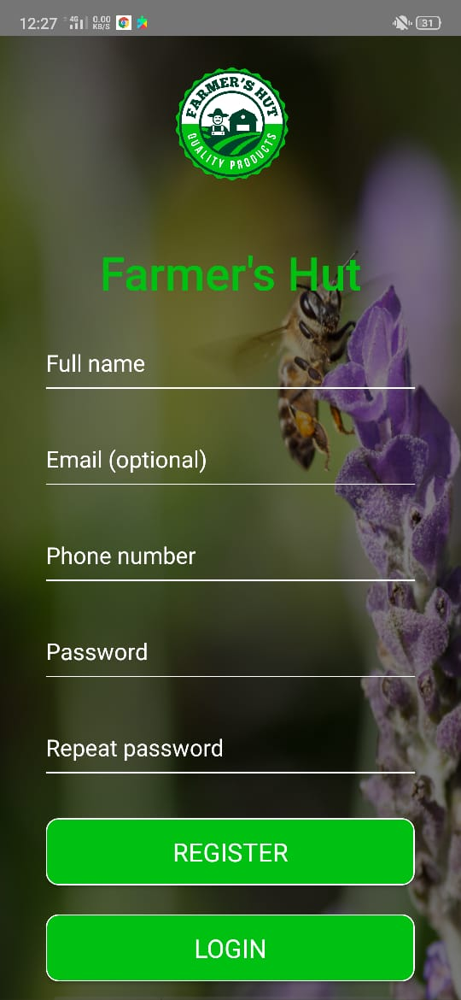
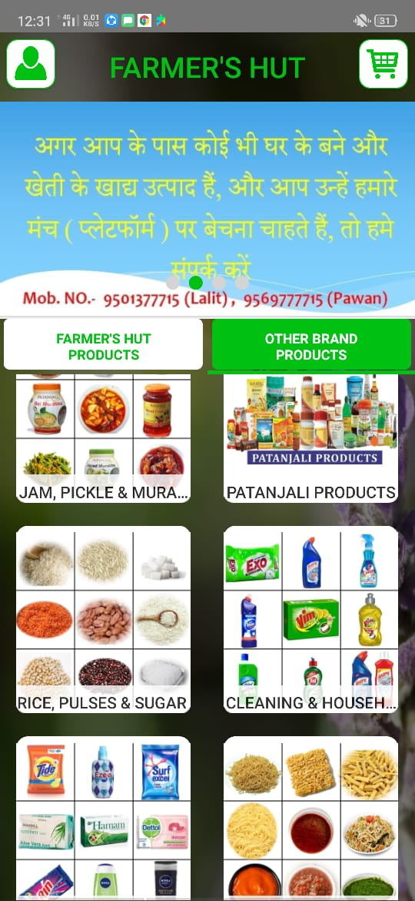
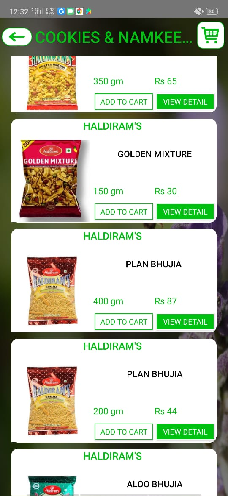
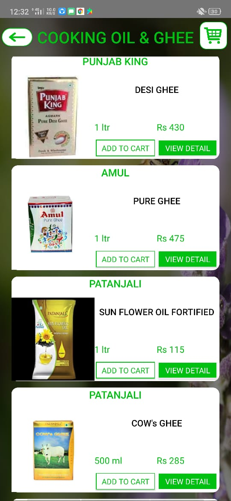
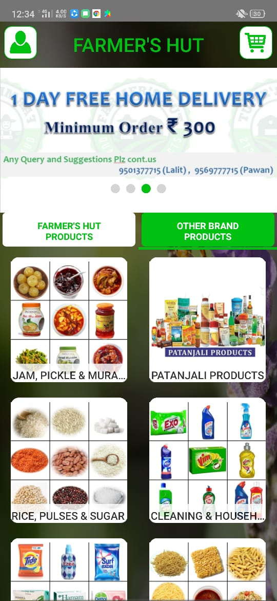

# farmer-hut
NativeScript is an open-source framework to develop apps on the Apple iOS and Android platforms.You can learn how to build a version of this app from scratch using either our JavaScript getting started guide, or our TypeScript and Angular getting started guide.
 
 
 ##  Screenshots

* ## Prerequisites
1. Globally installed Nativecript  - `npm install -g nativescript`
2. Globally installed Angular CLI - `npm install -g angular-cli`
3. Mac OS to build iOS app.

## Installation
This app is built with the NativeScript CLI. Once you have the [CLI installed](https://docs.nativescript.org/start/quick-setup), start by cloning the repo:
1. `git clone https://github.com/RedskyAtech/music-streaming-app.git`
2. `cd music-streaming-app`
3. `npm install` 

## App Functions
1.online shopping app
2.Push notifications
3.Social functions (feedback)
4.can add more product cateogories(admin app)
5.live tracking

## Run iOS Application
`tns run ios --bundle --env.uglify --env.snapshot --env.aot` 
## Build IPA Using
`tns build ios --bundle --env.uglify --env.snapshot --env.aot`

## Run Android Application
`tns run android --bundle --env.uglify --env.snapshot --env.aot`
## Build APK Using
`tns build android --bundle --env.uglify --env.snapshot --env.aot`

## NOTE:

Snapshot flag is only supported by MacOS. It will stripped off in windows OS.
    
